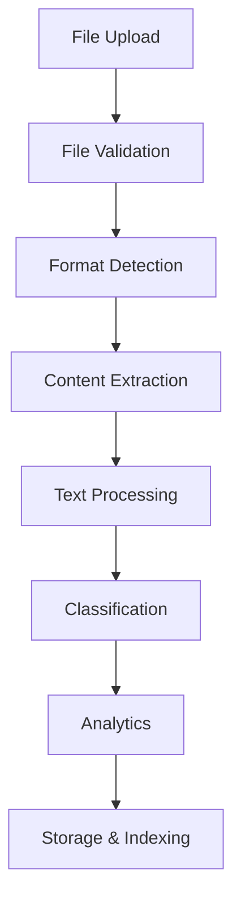

# 🚀 ADPA Phase 2 Implementation Plan

**Phase 2: Enhanced Processing (Days 29-84)**  
**Goal:** Build comprehensive document processing and analytics capabilities  
**Status:** 🟡 **IN PROGRESS** - Starting November 8, 2025

---

## 📋 Phase 2 Sprint Overview

Building on our solid **Phase 1 Infrastructure Foundation**, Phase 2 will transform ADPA into a powerful document processing and analytics platform.

### 🎯 **Phase 2 Success Criteria**
- ✅ Multi-format file processing (PDF, DOCX, TXT, Images)
- ✅ Advanced text extraction and OCR capabilities  
- ✅ Document classification and metadata extraction
- ✅ Basic analytics and reporting engine
- ✅ Real-time processing status updates
- ✅ Performance optimization for large files

---

## Sprint 3 (Days 29-42): File Processing Foundation

### Week 5: Enhanced File Upload System
- [🟡] **Day 1-2**: Multi-format file upload endpoint enhancement
  - Support PDF, DOCX, TXT, JPG, PNG, CSV files
  - File type validation and MIME type checking
  - File size limits and chunked upload support
  - Virus scanning integration (Windows Defender API)

- [⚪] **Day 3**: File storage optimization
  - Implement file deduplication using SHA-256 hashing
  - Temporary file management and cleanup
  - File compression for storage efficiency
  - Storage path organization by date/type

- [⚪] **Day 4-5**: File metadata extraction
  - Extract file properties (creation date, author, etc.)
  - Generate file thumbnails for images/documents
  - File encoding detection for text files
  - Metadata storage in processing results

### Week 6: Basic Document Processing
- [⚪] **Day 6-7**: PDF text extraction
  - Implement PDF processing using System.IO libraries
  - Handle encrypted/password-protected PDFs
  - Extract text while preserving structure
  - Handle multi-page documents efficiently

- [⚪] **Day 8**: Word document processing  
  - Process .docx files using System.IO.Packaging
  - Extract text content and formatting information
  - Handle embedded images and tables
  - Preserve document structure and metadata

- [⚪] **Day 9**: Excel data extraction
  - Process .xlsx files for data extraction
  - Convert spreadsheet data to structured format
  - Handle multiple worksheets and formulas
  - Extract charts and pivot table data

- [⚪] **Day 10-12**: Basic OCR integration
  - Implement Windows OCR API integration
  - Process JPG, PNG, TIFF, BMP image files
  - Text extraction from scanned documents
  - Confidence scoring for OCR results

**Sprint 3 Deliverables:**
- Enhanced file upload system supporting 6+ formats
- PDF and Word document text extraction
- Basic OCR for image files
- File metadata and thumbnail generation

---

## Sprint 4 (Days 43-56): Processing Pipeline

### Week 7: Document Classification & Processing Pipeline
- [⚪] **Day 13-14**: Document classification system
  - Automatic document type detection
  - Content-based classification (invoice, contract, report)
  - Language detection for multilingual support
  - Classification confidence scoring

- [⚪] **Day 15-16**: Text cleaning and normalization
  - Remove formatting artifacts and special characters
  - Standardize text encoding (UTF-8)
  - Language-specific text processing rules
  - Paragraph and sentence segmentation

- [⚪] **Day 17**: Metadata extraction enhancement
  - Extract key-value pairs from documents
  - Date and number pattern recognition
  - Named entity extraction (basic)
  - Document structure analysis

- [⚪] **Day 18-19**: Processing status tracking
  - Real-time processing status updates
  - Progress indicators for long-running processes
  - Error handling and retry mechanisms
  - Processing queue management

### Week 8: Analytics Foundation
- [⚪] **Day 20-21**: Basic document analytics
  - Word count, character count, page count
  - Language detection and confidence scoring
  - Reading time estimation
  - Document complexity metrics

- [⚪] **Day 22**: Processing performance metrics
  - Processing time tracking per file type
  - Throughput measurements (docs/hour)
  - Error rate monitoring by file type
  - Resource utilization tracking

- [⚪] **Day 23-24**: Basic reporting endpoints
  - Document processing summary reports
  - Analytics dashboard data endpoints
  - Export capabilities (JSON, CSV)
  - Historical processing trends

- [⚪] **Day 25-26**: Testing and optimization
  - Performance testing with large files
  - Memory usage optimization
  - Concurrent processing testing
  - Error scenario testing

**Sprint 4 Deliverables:**
- Document classification system
- Text processing pipeline
- Basic analytics engine
- Performance monitoring

---

## Sprint 5 (Days 57-70): Advanced Features

### Week 9: Advanced Text Processing
- [⚪] **Day 27-28**: Enhanced text extraction
  - Table extraction from documents
  - Form field recognition and extraction
  - Signature detection in documents
  - Header/footer identification

- [⚪] **Day 29**: Advanced OCR features
  - Multi-language OCR support
  - Handwriting recognition (basic)
  - Table recognition in images
  - OCR result confidence improvement

- [⚪] **Day 30**: Content analysis
  - Keyword extraction and ranking
  - Topic modeling (basic)
  - Sentiment analysis for text content
  - Content similarity detection

### Week 10: Real-time Features & Integration
- [⚪] **Day 31-32**: Real-time processing updates
  - SignalR integration for live status
  - WebSocket connections for progress updates
  - Real-time dashboard notifications
  - Processing queue visualization

- [⚪] **Day 33**: Batch processing capabilities
  - Multiple file upload and processing
  - Background job processing
  - Bulk operations support
  - Processing priority management

- [⚪] **Day 34-35**: Integration testing
  - End-to-end processing pipeline testing
  - Performance benchmarking
  - Memory leak testing
  - Concurrent user testing

**Sprint 5 Deliverables:**
- Advanced text extraction features
- Real-time processing updates
- Batch processing capabilities
- Comprehensive testing suite

---

## Sprint 6 (Days 71-84): Polish & Optimization

### Week 11: Performance & Scalability
- [⚪] **Day 36-37**: Performance optimization
  - Memory usage optimization
  - Processing speed improvements
  - Caching implementation for repeated operations
  - Database query optimization

- [⚪] **Day 38**: Scalability enhancements
  - Async processing queue implementation
  - Background service architecture
  - Resource pooling and management
  - Load testing and optimization

- [⚪] **Day 39**: Error handling enhancement
  - Advanced error recovery mechanisms
  - Partial processing result handling
  - User-friendly error messages
  - Processing retry strategies

### Week 12: Documentation & Deployment
- [⚪] **Day 40-41**: API documentation completion
  - Complete OpenAPI/Swagger documentation
  - API usage examples and tutorials
  - SDK/client library documentation
  - Integration guides

- [⚪] **Day 42**: Production readiness
  - Configuration management
  - Logging and monitoring setup
  - Security hardening
  - Deployment automation

**Sprint 6 Deliverables:**
- Production-ready document processing system
- Complete API documentation
- Performance-optimized implementation
- Deployment and monitoring setup

---

## 🛠️ Technical Implementation Details

### Enhanced File Processing Architecture
```csharp
// New Services to Implement
IFileProcessingService - Multi-format file processing
IOcrService - Optical character recognition  
IDocumentClassificationService - Auto-classification
ITextProcessingService - Text cleaning and normalization
IAnalyticsService - Document analytics and insights
IMetadataExtractionService - Metadata extraction
```

### Supported File Formats
```csharp
// Phase 2 File Format Support
PDF: Text extraction, metadata, thumbnails
DOCX: Content extraction, formatting preservation  
XLSX: Data extraction, sheet processing
TXT: Encoding detection, language identification
JPG/PNG: OCR text extraction, image analysis
CSV: Data parsing, structure analysis
TIFF: Multi-page OCR, document scanning
```

### Processing Pipeline Flow


### Performance Targets
```yaml
File Processing Speed:
  - PDF (10MB): < 30 seconds
  - DOCX (5MB): < 15 seconds  
  - Image OCR (2MB): < 45 seconds
  - Text files: < 5 seconds

Throughput:
  - Small files (<1MB): 100+ files/hour
  - Medium files (1-10MB): 50+ files/hour
  - Large files (10MB+): 20+ files/hour

Accuracy:
  - PDF text extraction: >98% accuracy
  - OCR recognition: >90% accuracy  
  - Document classification: >85% accuracy
```

---

## 📊 Phase 2 Success Metrics

### Technical Metrics
- [⚪] Support 6+ file formats with high accuracy
- [⚪] Process files up to 50MB without timeout
- [⚪] OCR accuracy >90% for clear images
- [⚪] Processing speed targets met for each format

### Functional Metrics  
- [⚪] Document classification accuracy >85%
- [⚪] Real-time status updates working
- [⚪] Batch processing of 100+ files
- [⚪] Advanced analytics and reporting

### Quality Metrics
- [⚪] Zero memory leaks during processing
- [⚪] Graceful handling of corrupted files
- [⚪] Performance under concurrent load
- [⚪] Complete error recovery mechanisms

---

## 🎯 Phase 2 Quick Start

### Immediate Next Steps (Today)
```bash
# 1. Enhance file upload controller
# 2. Implement PDF text extraction service
# 3. Add file validation and security
# 4. Create processing status tracking
# 5. Build basic analytics engine
```

### Development Priorities
1. **Multi-format file support** - Core processing capabilities
2. **Text extraction** - PDF, DOCX, OCR implementation  
3. **Processing pipeline** - Classification and analytics
4. **Real-time updates** - Status tracking and notifications
5. **Performance optimization** - Speed and memory efficiency

---

## 🚨 Phase 2 Risk Management

### Technical Risks
- **File processing complexity** - Use proven libraries and fallback methods
- **Memory usage with large files** - Implement streaming and chunked processing
- **OCR accuracy issues** - Multiple OCR engines and confidence scoring
- **Performance bottlenecks** - Async processing and background jobs

### Quality Risks
- **File corruption handling** - Robust validation and error recovery
- **Processing timeouts** - Configurable timeouts and progress tracking
- **Concurrent processing** - Thread-safe implementations and resource management

---

## 🏆 Phase 2 Expected Outcomes

### By End of Phase 2:
✅ **Comprehensive Document Processing** - Handle 6+ file formats efficiently  
✅ **Advanced Text Extraction** - PDF, DOCX, OCR with high accuracy  
✅ **Document Analytics** - Classification, insights, and reporting  
✅ **Real-time Processing** - Live status updates and progress tracking  
✅ **Production Performance** - Optimized for speed and scalability  

**Phase 2 Budget Estimate:** $75,000 - $150,000  
**Timeline:** 56 days (8 weeks)  
**Success Gate:** All file formats supported with >85% processing accuracy

---

**Ready to begin Phase 2 Enhanced Processing implementation! 🚀**

*Starting with Sprint 3: Multi-format file upload system enhancement*